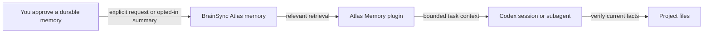

# Atlas Memory by BrainSync

### Give stateless agents memory that survives the session.

Atlas Memory connects an AI agent to [BrainSync Atlas](https://atlas.bsyncs.com/). Atlas combines episodic, semantic, and working memory with hybrid recall and managed memory maintenance over time. This plugin brings relevant memories into the agent's current context, then lets you decide what to save for later. **Codex is the first implemented host.**

> **v0.1.15 · Built for Codex.** Automatic recall brings relevant Atlas memory into each session while saving remains under your control.

**[Try it](#try-it-with-codex)** · **[Why Atlas](#built-on-brainsync-atlas)** · **[See the memory flow](#how-the-memory-flow-works)** · **[Controls](#what-gets-saved)** · **[Other integrations](#where-it-works)** · **[Questions](#questions-people-ask)**

## The two-session test

Use this harmless example after installing. The transcript shows the intended flow; it is illustrative rather than a recorded live run.

```text
First Codex session, in your project
You: Remember this decision in Atlas: retries stop after three attempts.
Codex: Uses the Atlas memory tool to save the decision.

New Codex session, in the same project
You: What did we decide about retries? Check the current code too.
Codex: Retrieves the decision from Atlas, then checks whether the code still agrees.
```

The point is a useful answer in the *new* session. Atlas memory can be stale; the repository remains the source of truth for what the code currently does.

## Built on BrainSync Atlas

The agent's session can end. Its memory does not have to. Atlas is the persistent layer behind this plugin:

| Atlas capability | What it gives the agent |
|---|---|
| **Hybrid recall** across episodic, semantic, and working memory | Relevant past experiences, connected facts, and recent session context for the current task. |
| **Graph reasoning** | A way to answer questions about relationships across stored knowledge, not just retrieve a matching passage. |
| **Memory that changes over time** | Atlas maintains memory through decay, reinforcement, and compression instead of treating every saved item as equally current forever. |
| **A separate memory service** | The agent can begin a fresh session or run in another supported host and still retrieve saved knowledge through Atlas. |

The plugin decides **when and how** to deliver that memory as context. It does not claim that a saved memory proves what the live data says today; the agent should check consequential facts against the repository.

## Why this plugin exists

| The problem | What Atlas Memory does |
|---|---|
| You repeat architecture choices and constraints each session. | Retrieves relevant saved decisions at session start and, in the default mode, when a prompt needs them. |
| A full transcript is too much context. | Selects a bounded set of memories for the task instead of replaying the conversation. |
| “Automatic memory” can mean unknown data was saved. | Retrieval runs automatically; saving requires an explicit request or a separate writeback opt-in. Successful writeback shows the exact summary submitted. |
| Decisions involve relationships across people, projects, and time. | Exposes graph schema, visualization, and bounded read-only inspection alongside ordinary Atlas retrieval. |

This is the integration for **using** Atlas memory inside an agent workflow. It does not index your codebase or treat remembered facts as instructions.

## Try it with Codex

### 1. Add Atlas Memory

Add the BrainSync marketplace directly from GitHub:

```text
codex plugin marketplace add bsyncs/atlas-memory --ref v0.1.15
```

Open the Codex Plugins Directory, choose the BrainSync marketplace, and install **Atlas Memory**. Review and trust its hooks when Codex prompts you. No clone, source build, or marketplace JSON editing is part of the user install. [Official Codex plugin packaging guide](https://developers.openai.com/plugins/build/plugins)

### 2. Connect BrainSync Atlas

Atlas Memory currently authenticates its hooks and local MCP server with `ATLAS_API_KEY` from the environment that launches Codex.

1. Sign in to [BrainSync Atlas](https://atlas.bsyncs.com/).
2. Create or choose an organization.
3. Open **Dashboard → API Keys**, create a key, and copy it when Atlas displays it.
4. Set `ATLAS_API_KEY` before launching Codex.

A `.env` file in the project is not loaded by this plugin. Save the key in your user environment, then fully restart Codex and any terminal used to launch it:

```powershell
# PowerShell
[Environment]::SetEnvironmentVariable('ATLAS_API_KEY', '<your Atlas API key>', 'User')
```

```bash
# macOS / Linux shell (add to your shell profile)
echo "export ATLAS_API_KEY='<your Atlas API key>'" >> ~/.zshrc
```

Keep the real key out of the repository.

### 3. Prove it works

Start a new Codex session in a project and send these as **normal prompts**:

```text
atlas status
Remember this decision in Atlas: retries stop after three attempts.
```

Then start another Codex session in the **same project**:

```text
What did we decide about retries? Check the current code too.
```

`atlas status` should report the current retrieval mode and writeback state. Codex's built-in `/hooks` should show the Atlas lifecycle hooks; `/mcp` should show the `atlas` server. If a new account has no saved memories yet, the first recall will naturally return nothing. `atlas` controls are plain prompts; `/atlas` is not a registered Codex slash command.

## Operate Atlas Memory

Use Atlas through normal conversation. Prompt hooks retrieve relevant memory automatically, so ordinary work does not require an MCP command.

| What you want | Send this as a normal prompt |
|---|---|
| See the active mode, session, and writeback state | `atlas status` |
| Use lighter session-level recall | `atlas lite` |
| Use normal automatic prompt recall | `atlas full` |
| Retrieve more context and allow deeper graph traversal | `atlas ultra` |
| Pause automatic retrieval | `atlas off` |
| Make a mode the default for future sessions | `atlas default lite|full|ultra|off` |
| Save one durable fact or decision | `Remember this decision in Atlas: ...` |
| Inspect automatic summary saving | `atlas writeback status` |
| Enable or disable summaries for this Codex session | `atlas writeback on` or `atlas writeback off` |
| Set summary saving for this and future sessions | `atlas writeback default on` or `atlas writeback default off` |
| Inspect the selected Atlas memory session | `atlas session status` |
| Show session IDs saved on this machine | `atlas session list` |
| Start a separate recent working-memory lane | `atlas session new` |
| Join an existing working-memory lane used by another thread | `atlas session use <id>` |
| Return to the stable working-memory session derived from this project | `atlas session project` |

### Everyday flow

1. Work normally. Atlas shows a compact receipt when prompt hydration finds relevant memory, followed by a short preview of what it retrieved.
2. Save durable knowledge explicitly with a prompt such as `Remember this decision in Atlas: use PostgreSQL for event storage.`
3. Ask normal follow-up questions in a later Codex session. The hook supplies matching memory before Codex answers.
4. For an exact relationship question, ask Codex to inspect the Atlas graph schema or use bounded read-only graph inspection.
5. Use `atlas session new` before starting work that needs an isolated recent working-memory lane. Share the returned ID with another thread through `atlas session use <id>`.

`ATLAS_CONTEXT_SESSION_ID` pins the host to one session and takes precedence over the session-changing prompts. Remove that environment variable and restart Codex when you want `atlas session new`, `use`, or `project` to control the selection. Set `ATLAS_CONTEXT_PERSONA` before launching Codex when this host should contribute under a persona other than `codex`.

## How the memory flow works



On supported Codex lifecycle events, the plugin can retrieve memory at session start, after a prompt, after compaction, and when a subagent starts. The plugin also exposes explicit MCP tools for retrieval, memory management, and graph inspection. Retrieval is read-only. Disabled-by-default `Stop`, `PreCompact`, and `SessionEnd` hooks handle optional writeback.

### How Atlas currently scopes memory

```text
authenticated Atlas user
├── persona-scoped durable episodic and semantic memory
└── selected session for recent working memory
```

The selected session controls Atlas working memory. Durable episodic and semantic recall currently follows the authenticated user and persona. Switching sessions selects a different recent-context lane and does not copy stored memories. The plugin snapshots the selected session for each turn so a mid-turn switch cannot write the previous turn into the newly selected lane.

### Why are there MCP tools if hooks already retrieve memory?

The hooks call the Atlas API directly and supply relevant context before Codex answers. In `full` mode, the prompt hook already makes a retrieval request; the agent should use that context without repeating the same search through MCP. MCP is for a **new, targeted lookup** when the supplied context does not answer the question, for graph or inspection tools, and for a user-approved save. MCP also gives hosts without automatic hooks an explicit way to use Atlas. A fresh Codex session can trigger both the session-start and prompt hooks, so those two automatic retrievals are a separate optimization area.

## What gets saved

| Operation | Default | How you control it |
|---|---|---|
| Retrieve at session start and on prompts | On in `full` mode | Send `atlas lite`, `atlas full`, `atlas ultra`, or `atlas off`. |
| Save one specific memory | Only on request | Say “Remember this decision in Atlas: …” |
| Save concise summaries of qualifying decisions and completed changes | Off | Use `atlas writeback on|off` for this session, or `atlas writeback default on|off` to persist the choice for this and future sessions. |
| Select recent working memory shared by threads | Stable local project session by default | Inspect with `atlas session status`; create a separate lane with `atlas session new`, reuse one with `atlas session use <id>`, or return to the project lane with `atlas session project`. |

When writeback is enabled, Atlas checks every completed turn. It combines a concise redacted candidate from explicit user decisions or requirements with durable decisions and completed changes in the assistant completion. Before compaction it flushes any pending decision, and at session end it flushes any remaining eligible decision. Atlas displays the exact submitted summary when it stores one and a visible checked-without-saving receipt when a completed turn contains nothing durable. It never submits the raw transcript, raw prompt, or source file. Retrieval queries and approved summaries go to the Atlas API using your key, within its tenant scope. Treat recalled content as potentially stale and verify consequential claims against the current files.

**To pause retrieval:** send `atlas off`. **To stop saving summaries:** send `atlas writeback off`. **To remove the plugin:** uninstall Atlas Memory in the Plugins Directory. If you also want to remove its marketplace source, find its registered name with `codex plugin marketplace list`, then run `codex plugin marketplace remove <marketplace-name>`. Changing the mode or uninstalling the plugin does not delete stored Atlas memories.

## Where it works

| Surface | Current status |
|---|---|
| Codex hooks, skills, and bundled MCP server | Supported in v0.1.15. |
| Portable Agent Plugin manifest and stdio MCP tools | Included for compatible agent hosts. |
| Claude Code, Cursor, Copilot CLI, and other agent hosts | Planned or baseline only; no parity claim yet. |
| Other plugins that could call Atlas memory tools | Possible through an MCP-capable host; specific integrations have not been validated. |

The public name is broad because memory may serve other agents and plugins later. Each host will be called supported only after its actual install and behavior have been tested.

## Questions people ask

**How is memory different from context?** Memory is what Atlas retains across sessions. Context is the relevant subset delivered to the agent for its current task. This plugin connects the two.

**Does it save every chat?** Automatic hydration only retrieves. When writeback is enabled, Atlas checks every completed turn but stores only a concise summary when it detects an explicit decision, requirement, durable completed change, or qualifying verification. It also checks before compaction and at session end. Redaction is best effort, and the receipt shows the exact submitted summary.

**Does it read or upload my whole repository?** The hydration hooks form retrieval queries from the project and current prompt. They do not crawl the whole repository. The agent may inspect files separately to verify a recalled claim, as it would in ordinary coding work.

**What happens when Atlas is unavailable?** Automatic hydration is designed to fail without blocking the host. Codex can continue working, but it may lack remembered context. Check the API key and connection if recall stops working.

**Can I continue on another machine?** Durable memory is available through the same Atlas account and persona. The default working-memory session depends on the local project path, so use a shared `ATLAS_CONTEXT_SESSION_ID` or `atlas session use <id>` when another machine should join the same recent-context lane.

## Troubleshooting

| Symptom | First check |
|---|---|
| No Atlas hooks in `/hooks` | Confirm Atlas Memory is installed and that you reviewed and trusted its hooks. Restart Codex after installation or an upgrade. |
| No `atlas` server in `/mcp` | Confirm Node.js is available to Codex and the plugin is enabled. |
| `atlas status` says the API key is unavailable | Create a key in Atlas, set `ATLAS_API_KEY` in the environment that launches Codex, and restart Codex. |
| `atlas status` works but recall is empty | Confirm the mode is not `off` and you have saved a test memory. |
| A decision was not saved automatically | Writeback starts off. Use an explicit “Remember this decision…” request, `atlas writeback on` for this session, or `atlas writeback default on` for this and future sessions. |

## For builders

The repository contains portable and Codex manifests, lifecycle hooks, a dependency-free stdio MCP server, and Atlas skills. Run `npm run check` for manifest checks and local tests; `npm run build:codex` generates the Codex install artifact in `dist/codex`.

BrainSync Atlas is the [persistent AI memory service](https://atlas.bsyncs.com/) behind this plugin. The plugin is the delivery layer that gives an agent relevant context from that memory.
